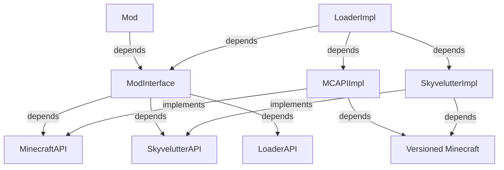

# Project Structure

Arrows denote that `[from] depends on [to]`

LoaderAPI -- impl by -- Loader
MinecraftAPI -- impl by -- MC API impl
SkyvelutterAPI -- impl by -- Skyvelutter

Mod - Loader - Platform
